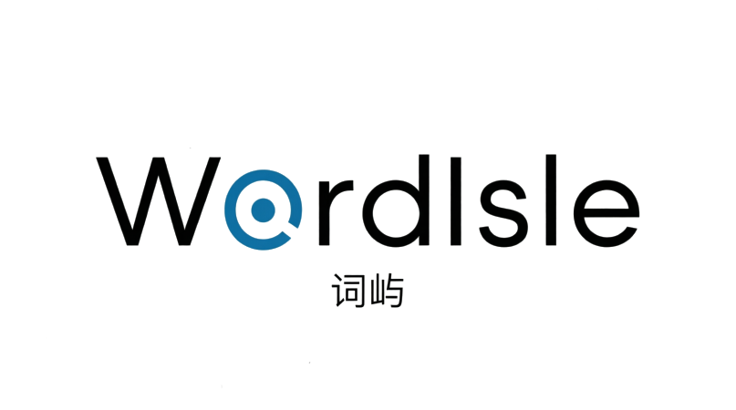
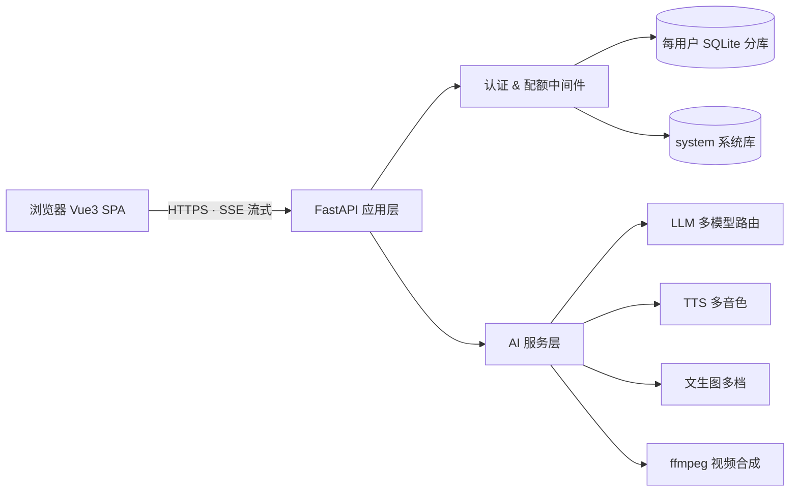

<div align="center" style="display:flex; align-items:center; justify-content:center; gap:20px">
  
  
</div>

> 一个 **AI 驱动的英语顽固词深度加工平台**：把「背了八遍还记不住的词」送进 AI 生成的语境、场景与连环画里，通过记忆测试和智能助手让词汇在场景中生根。


    

***

## ✨ 这个项目在做什么

传统背单词 App 只给「单词 + 释义」，单词在脱离语境时很难被真正记住。本项目把 **AI 生成能力（LLM / TTS / 文生图 / 视频合成）** 和 **间隔重复记忆法** 组合成一条完整的「顽固词加工流水线」：

```
顽固词上岛 → AI 生成语境例句 → 场景聚合 → 单词连环画 / 记忆视频 → 间隔复习 → 熟词僻义 & 词根拆解
```

* **L0 → L1 分层智能助手「词小屿」**：L0 用 FAQ 知识库关键词直答（零 LLM 调用），L1 用 Function Calling 让助手具备查词、复习、增删词的真实操作能力，全程 SSE 流式打字机输出。

* **从个人工具沉淀为完整产品**：产品落地页 → 认证登录 → 每用户独立数据分库 → 每日配额 → 用量看板 → 反馈闭环，是一个结构完整的全栈 AI 应用。

## 🎯 核心特性

* 🤖 **智能助手「词小屿」** — 常驻悬浮面板，L0 FAQ 直答 + L1 工具调用（查词/复习/加词/删词），流式输出带打字机、点赞点踩、建议追问、语音输入朗读

* 📖 **AI 语境生成** — 顽固词一键生成地道例句与场景短文，附带音标、词性与多套语境

* 🎨 **单词连环画** — 用文生图模型把一组单词编成多格连环画（角色一致，可下载）

* 🎬 **记忆视频编译** — 图 + 词义 + 英文字幕烧录成短视频，配合 TTS 语音讲解

* 🗂️ **场景聚汇** — 从一段真实文本里自动聚类「场景 + 生词」，词汇跟着场景走

* 🔁 **记忆测试** — 间隔重复（到期复习/测验），AI 辅助「疗愈」顽固词

* 🔍 **熟词僻义检测** — 自动识别「看似认识、实则僻义」的词并给出商务义

* 🧩 **构词拆解** — 词根词缀自动分析 + 同根词扩展，成串记词

* 👥 **多用户系统** — 开发者/管理员/游客三角色，每用户独立 SQLite 分库，游客按日配额

* 💰 **多模型成本阶梯** — LLM / TTS / 文生图均支持多档模型，设置页一键切换，按任务按成本择优

## 🛠️ 技术栈

| 层   | 选型                                             | 选择理由                                     |
| --- | ---------------------------------------------- | ---------------------------------------- |
| 前端  | Vue 3 + Element Plus（全局构建）                     | 组件化开发，**免打包工具链**，后端模板直出 + ES Module，部署极简 |
| 后端  | Python + FastAPI + uvicorn                     | 异步原生、**SSE 流式**一等公民、类型提示，AI 服务化的工业标准     |
| 数据库 | SQLite 每用户分库 + system 库                        | 个人项目零运维；**天然的多租户隔离**，避免单库权限纠葛            |
| LLM | DeepSeek / 阿里云百炼 qwen 系列                       | 多路由 + 设置页切换，成本与质量按需权衡                    |
| TTS | 阿里云百炼 CosyVoice / Qwen-Audio-TTS               | 多音色英文语音，高质量听力音频                          |
| 文生图 | 百炼 wan2.7-image / qwen-image + TokenRhythm 免费档 | 连环画角色一致性 + 免费/付费多档成本阶梯                   |
| 视频  | ffmpeg（drawtext 字幕烧录）                          | 本地合成，零外部服务依赖                             |
| 部署  | systemd + Nginx（Basic Auth / 限源 IP / SSH 隧道）   | 2C2G 小服务器即可常驻运行                          |

## 🏗️ 架构设计



* **每用户独立分库**：`data/user/<uid>.db`，用户间数据物理隔离；登录时按需建库，零迁移负担。

* **SSE 流式 + 前端打字机**：LLM 结果按语义切块逐段下发（保留换行结构），前端 rAF 动画逐字呈现，首字延迟低。

* **Agent 分层**：FAQ 关键词直答（L0，零成本秒回）→ Function Calling 工具调用（L1，4 个工具），写操作只产意图、前端确认后才执行——**安全铁律**。

* **异步任务**：图片/视频生成走 `*stream` 端点 + 前端轮询，长耗时任务不阻塞主链路。

## 🌐 在线体验（内测）

* **公网地址**：<http://111.228.47.105/>

* **运行状态**：已部署至 Linux 服务器（systemd 常驻，2C2G 实例），线上稳定运行中

* **访问账号**：内测账号不对外公开，网页可游客体验（每日免费额度）

> 内测实例为学习与演示用途，AI 生成为付费接口，请勿压测或高频调用，以免影响真实使用。

## 🚀 快速开始

```bash
# 1. 克隆并进入
git clone https://github.com/user0752/WordIsle.git
cd WordIsle/mvp

# 2. 安装依赖（Python 3.10+）
python -m venv venv
venv\Scripts\activate        # Windows
# source venv/bin/activate  # Linux/macOS
pip install -r requirements.txt

# 3. 配置 API Key（DeepSeek / 阿里云百炼，见 .env.example 注释）
cp .env.example .env

# 4. 启动
python main.py
# 打开 http://localhost:8000
```

> 也可以使用项目自带的图形化启动管理器：`python manager.py`（GUI）或 `python manager.py --cli`（终端模式）。

## ☁️ 生产部署

支持 **systemd 常驻 + Nginx 访问控制**，2C2G 的 Ubuntu/Debian 小服务器即可稳定运行；提供 `start.sh` / `start.bat` 一键启动与 `manager.py` 运维管理。

详细部署步骤（Nginx Basic Auth、限源 IP、SSH 隧道、验证清单）见 [mvp/README.md](mvp/README.md)。

## 📂 项目结构

```
WordIsle/
├── mvp/                     # 主应用
│   ├── main.py              # FastAPI 入口（模板直出 + 静态资源）
│   ├── routes.py            # 业务路由（生成/单词/复习/场景/视频/设置…）
│   ├── assistant.py         # 智能助手「词小屿」（L0 FAQ + L1 Function Calling）
│   ├── assistant_faq.json   # 36 条 FAQ 知识库
│   ├── services.py          # AI 服务层（LLM/TTS/文生图/视频多模型路由）
│   ├── db.py                # 数据层（每用户分库 + 系统库 + 看板聚合）
│   ├── auth.py              # 认证 + 角色 + 每日配额
│   ├── config.py            # 配置（env / 模型常量 / 配额）
│   ├── middleware.py        # 日志与中间件
│   ├── templates/           # 落地页 / 登录页 / 主应用（Vue3）
│   ├── static/              # JS（api/assistant/utils/constants）+ CSS + 图片
│   ├── test_*.py            # 93 个自动化测试用例
│   └── deploy/              # systemd 服务单元
├── manager.py               # 图形化/终端启动管理器（日志、健康检查、重启）
├── manager.bat / start.bat  # Windows 一键启动
└── logo.png                 # 品牌 Logo
```

## ✅ 测试与质量

* **93 个自动化测试用例**覆盖：认证与角色权限、游客配额、核心生成接口、反馈闭环、智能助手（FAQ 路由 / 工具调用 / 会话 / 反馈），全量回归通过。

* **跨模块测试隔离**：处理了多模块共享进程下的全局状态污染（分库缓存、模块级常量），保证测试可重复。

* 提交遵循 Conventional Commits（`feat/fix/docs/refactor` + 中文说明），部署流程文档化。

## 🧭 开发路线

| 版本   | 状态     | 内容                            |
| ---- | ------ | ----------------------------- |
| v1.0 | ✅ 已完成  | AI 语境生成 + TTS + 最小可跑版         |
| v2.0 | ✅ 已完成  | 产品化：认证分库、落地页、多角色、用量看板         |
| v3.0 | ✅ 已完成  | 多媒体：单词连环画、记忆视频编译、场景聚汇         |
| v4.0 | ✅ 已完成  | 智能助手「词小屿」+ 熟词僻义 + 构词拆解 + 反馈闭环 |
| v5.0 | 📅 计划中 | 移动端适配、分享链接、更多记忆算法策略           |

## 👤 关于作者

大三学生，主攻 **AI 应用开发**（Agent / RAG / 多模型工程化）。这个仓库是我把课堂所学真正落地成「能跑、能部署、有真实用户路径」的完整产品的实践：

* 不只调用 API，而是亲手设计 **Agent 分层、SSE 流式、用户分库、成本阶梯** 等工程细节；

* 完整经历「需求 → 架构 → 实现 → 测试 → 部署 → 迭代」闭环；

* 如果你也在做 AI 应用，欢迎交流。

